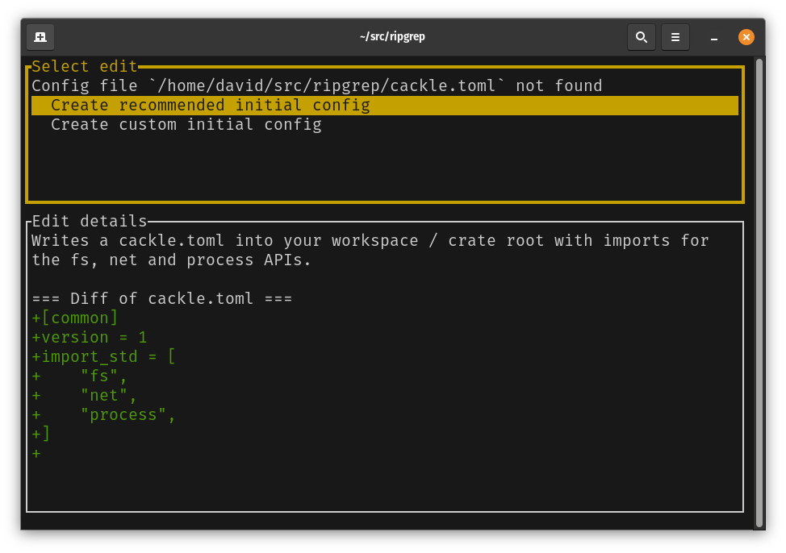
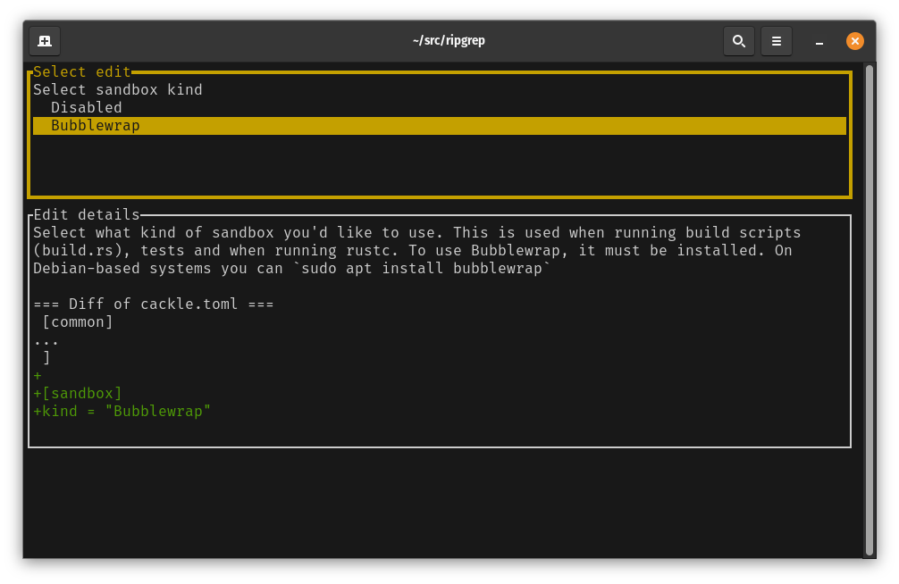
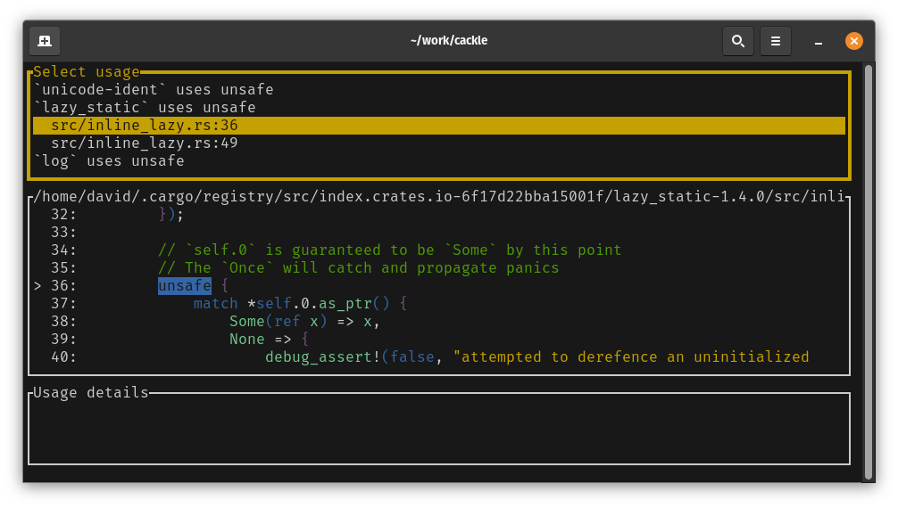
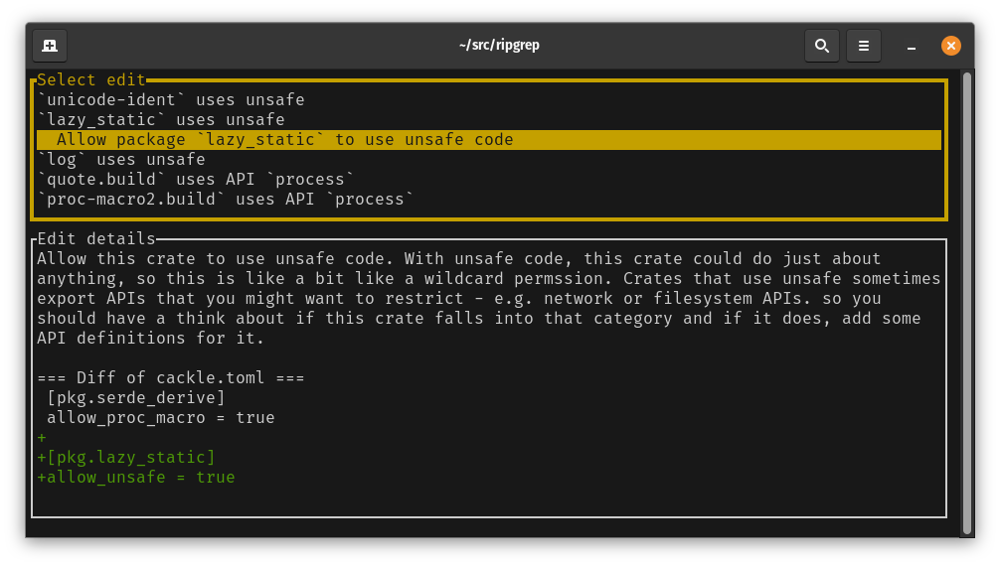
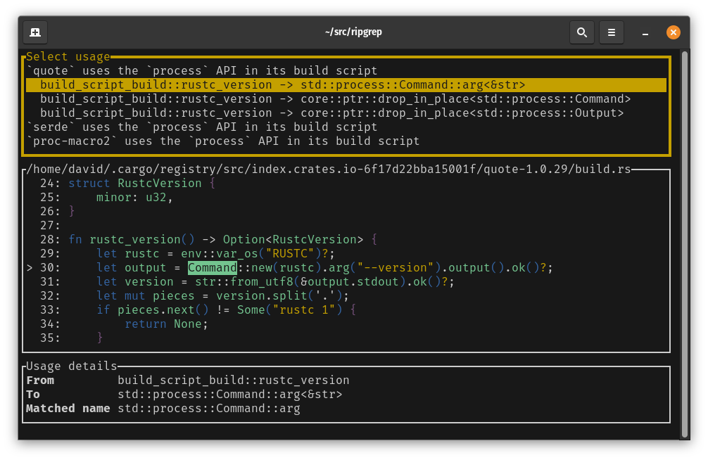
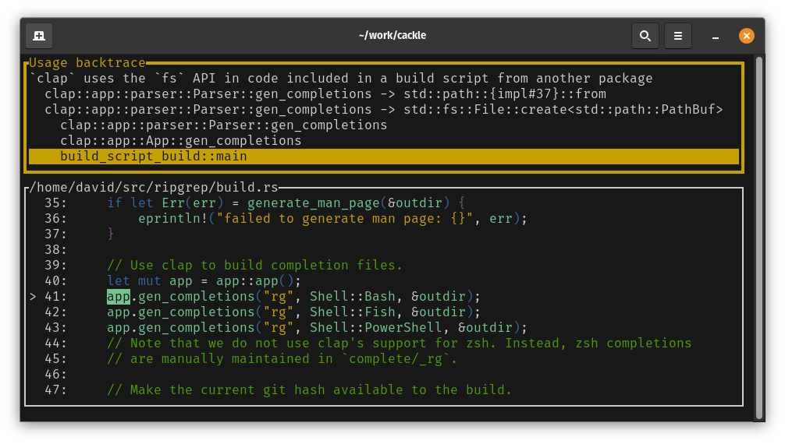

# Making Rust supply chain attacks harder with Cackle

If you want a slightly shorter read, skip to [Introducing Cackle](#introducing-cackle-aka-cargo-acl).

## A hypothetical story about Alex

Alex is a software engineer who has built a tool which she licences to her customers. She only has a
small number of clients, but they like her tool. She built her tool using Rust, with about 20 direct
dependencies from crates.io. When you count indirect dependencies, her tool has about 250
dependencies.

One of those indirect dependencies is a crate named `foobar`, which was written by someone named
Chris. Chris wrote `foobar` a few years ago, but has lost interest in maintaining it.

Someone called Bob has filed a couple of PRs against `foobar` and is now asking when they might get
merged and if the project is still maintained. Bob says that they'd be happy to maintain the crate
if Chris is too busy. Bob seems enthusiastic, so Chris adds Bob as an owner.

Some months go by and Alex is fixing a bug that one of her clients noticed. After fixing the bug,
she runs `cargo update`, runs the tests, does some manual testing, then pushes out the updated
version of her tool to her clients. The updated version of her tool includes an updated version of
the crate `foobar`.

A week later she gets a call from one of her clients who is extremely upset. It seems that the
client’s user database has been leaked and the attackers are threatening to publish it if a ransom
isn’t paid. Her client has determined that Alex’s tool is sending data to an unknown address on the
Internet.

After some investigation, Alex finds some code in the new version of `foobar` that is doing this.
She pins an old, unaffected version of the `foobar` crate and does a new release, but the damage to
her small business and her reputation is already done.

## Supply-chain attacks

The story about Alex is an example of a supply-chain attack. There are many ways something like this
could happen:

* A developer’s crates.io token could be compromised.
* A burned-out developer could hand over control of a crate to someone they don’t really know.
* Someone could build a crate, then submit PRs to other projects to make use of their crate. Later
  they could add malicious code to their own crate.
* Developers sometimes add protest-ware to their own crates. Even if this is for a good cause, it
  still has the potential to cause substantial damage and loss of trust.

This kind of thing hasn’t happened much yet in the Rust ecosystem, but as it grows, it’s expected to
happen more often. It already happens semi-regularly in other larger ecosystems like node.js and in
Python’s package systems.

## Practices to help prevent supply-chain attacks

There are numerous things you can do to help prevent supply-chain attacks:

* Review the code of crates that you use.
* Use and contribute to a code vetting database like
  [cargo-vet](https://github.com/mozilla/cargo-vet) or
  [cargo-crev](https://github.com/crev-dev/cargo-crev).
* Avoid depending on trivial crates that would only save you a few lines of code (e.g. left-pad from
  node.js). Not only do trivial dependencies not save you much code, they're also potentially higher
  risk due to them being easier to create.
* All else being equal, prefer crates with more downloads.
* Select crates that are written by people you recognise and who have a good reputation in the
  community - although everyone is new at some point, so this is a trade-off.
* Copy the `cargo add` command from crates.io rather than typing the name by hand. This can help
  prevent you from being the victim of typosquatting attacks.
* For binary crates where you don't need or want new features, bug fixes etc, you could consider
  pinning their versions. If you do though, then you should monitor for security advisories.

For crate authors there are some additional steps you can take:

* When reviewing PRs, look carefully at any newly added dependencies.
* Be careful about to whom you hand control of your crates.
* Consider asking new maintainers to fork your crate rather than handing it over.

## Introducing Cackle aka cargo-acl

Cackle is a code ACL checker and is an additional tool to help make supply-chain attacks harder.
It’s intended to be used in addition to the above approaches. Cackle is configured via `cackle.toml`
that sits alongside `Cargo.toml`. In the configuration file, you can define classes of APIs, such as
“net”, “fs” (filesystem) and “process” that you’d like to restrict. You then say which crates that
you depend on are permitted to use these APIs. When run, Cackle checks for any crates in your
dependency tree that are using restricted APIs that they’re not permitted to use.

An API definition says what names are included or excluded from that API. For example, we might
define the "process" API as follows:

```toml
[api.process]
include = [
    "std::process",
]
exclude = [
    "std::process::exit",
]
```

Exclusions take precedence over inclusions, so should be more specific. Here we're defining an API
named "process" and classifying any functions in the `std::process` module as belonging to it. We
then exclude `std::process::exit`. So a reference to `std::process::Command::new` would count as
using the `process` API, but a reference to `std::process::exit` would not.

We can then allow specific packages to use this API. For example:

```toml
[pkg.rustyline]
allow_apis = [
  "fs",
]
allow_unsafe = true
```

This says that the `rustyline` package is allowed to use filesystem APIs and also allowed to use
unsafe code.

In the case of Alex’s story, had she been using Cackle, then the ``foobar`` crate might have been
flagged as now using the “net” API where previously it wasn’t.

## Installing Cackle

For the time being, Cackle only supports Linux. Assuming you've already got Rust installed, you can
run:

```sh
cargo install --locked cargo-acl
```

## Building an initial config

Cackle has a built-in terminal UI that helps with creation of your cackle.toml. We'll use that to
create our initial configuration. From the directory containing your `Cargo.toml`, run:

```sh
cargo acl
```

The problems pane shows problems that have been detected so far with the permissions used by your
dependencies. Initially, it also shows action items that help with creating your configuration.


We select a problem and press 'f' to show possible fixes.



Here we can see two possible initial configurations that we can create. We select that we'd like to
use the recommended initial configuration and press 'f' to apply the fix.



Next, the UI will ask us to select what kind of sandbox we'd like to use. At the moment, the only
supported sandbox is Bubblewrap. The sandbox is used for running build scripts, for running rustc
(and thus procedural macros) and for running tests. APIs used by each binary are checked by cackle
before they get run, so depending on how carefully you're checking those API usages, you may decide
not to worry about sandboxing.

At this point, we've imported APIs that restrict network access, filesystem access and command
access via the standard library. We haven't however restricted similar APIs that might be provided
by third-party crates in our dependency tree. For example, tokio can be used to perform network
access, but we haven't classified any of its APIs as doing so.

Third-party crates can export cackle API definitions. If any do, then the cackle UI will ask us if
we'd like to import those API definitions. While cackle is fairly new however, it's expected that
we'll need to write such API definitions ourselves. We might write a "net" API definition for
`tokio` as follows:

```toml
[api.net]
include = [
    "tokio::net",
]
```

Here we're saying that references to anything in the `tokio` crate's `net` module should be
classified as a use of the `net` API.

We can manually edit our cackle.toml to add this API definition. It will be merged with the
definition of the `net` API for the standard library that is built into Cackle and which we imported
when we created our initial configuration.

Cackle will now proceed to build your crate and its dependencies. As the build proceeds, cackle will
analyse object files, executables and source code to see what APIs are used from where and which
crates use unsafe. As problems are found, they'll be added to the "problems" pane in the UI.


Details about the package involved are shown in the bottom pane. You can use this to help understand
what the package does, which can be useful for deciding if it's reasonable for it to use a
particular API.

If you'd like to see how a package was included, you can view the tree from current problem's
package to your package by pressing 't'.


For API usages and unsafe code, you can press 'd' to see further details of each usage location of
that API or unsafe code.



If you're happy for the crate to use that API or unsafe, you can press 'f' to see available fixes to
the configuration file.



Press 'f' again to apply the selected fix.

Similar to the unsafe usages, the usage locations for a disallowed API can be shown by pressing 'd'.



Here we can see that the build script for the `quote` crate is using the process API by referencing
`std::process::Command`.

Like with other problems, we can press 'f' to see available fixes.


We have a few options for allowing an API usage. The `quote` crate used the `process` API from its
build script. We can allow just this, which is the first available fix.

Alternatively, we might choose to allow the `quote` crate to use the `process` API, but only as part
of build scripts. This would mean that code in for example `quote`'s `lib.rs` could use the
`process` API if that code was then used by a build script from another package. It would also allow
`quote`'s own `build.rs` to use the `process` API.

Lastly we might allow `quote` to use the `process` API regardless of what kind of binary is being
built.

The bottom pane shows a description of the change being made as well as a diff of your
`cackle.toml`.

Only API usages in reachable code are considered. If you'd like to see how the code is reachable you
can press 'b' to get a backtrace showing a path of function references from main to the function
that used the API.



Here we can see that the ripgrep build script is calling clap's `App::gen_completions`, which calls
`Parser::gen_completions` which is what's using `File::create`.

Note that this isn't a runtime backtrace - the build script hasn't been executed yet. It's a
hypothetical backtrace built from the graph of what functions reference what other functions. Press
escape to leave the backtrace.

Other kinds of problems that cackle might detect with your dependencies are:

* A build script (build.rs) failing. This might be because it attempted to access the network, or
  tried to write a file outside of its output directory. Possible fixes are to allow network access,
  allow writes to a particular directory or disable the sandbox for that particular build script.
* A build script might emit instructions to cargo, requesting extra arguments to the linker. This
  can be a source of code that we're not checking, so we want to look to see if what's being done is
  reasonable, then if it is, allow it.

Once all problems have been resolved, Cackle will exit.

We might like to integrate Cackle into our CI. To do so, we'd run:

```sh
cargo acl -n
```

And if we'd like to also then run the tests under cackle, we'd do:

```sh
cargo acl -n test
```

In a github action, we might do this as follows:

```yml
name: cackle
on: [push, pull_request]

jobs:
  cackle:
    name: Cackle check and test
    runs-on: ubuntu-latest
    steps:
      - uses: actions/checkout@v3
      - uses: dtolnay/rust-toolchain@stable
      - uses: cackle-rs/cackle-action@latest
      - run: cargo acl -n
      - run: cargo acl -n test
```

This will do a non-interactive check of our dependencies against the configuration. If any problems
are encountered, details will be printed and it will exit with a failure status.

If your `Cargo.lock` is checked into your repository, you might like to add `rm Cargo.lock` to your
CI before running `cargo acl`, that way we'll be checking the latest semver-compatible versions of
your dependencies.

## How it works

When you run `cargo acl`, Cackle invokes `cargo build`, but wraps rustc, the linker and any build
scripts. As the build progresses, the wrappers communicate back to the parent cackle process, which
analyses the build artefacts in order to determine what APIs are being used. It does this by parsing
the object files to determine what functions reference what other functions. It also parses the
debug information in the linked executable in order to determine the source locations for each
reference. Source files are then mapped back to the package that provided that source file via
`deps` files written by rustc.

One nice thing about the fact that Cackle analyses the final executable is that dead code is not
considered with regard to API usage. So for example if you depend on the `image` package to encode
PNGs, but don’t use functions from the image crate that read or write files, then those functions
shouldn’t go into the executable, which means Cackle won’t classify the image package as using
filesystem APIs. This means that if later, the `image` package started doing filesystem access from
a function that wasn’t previously, it would be flagged as using a disallowed API.

## Circumvention

There are of course ways to circumvent Cackle and use an API without detection.

One way is if your configuration is incomplete. For example, if your crate depends on tokio, but you
don't add `tokio::net` to the includes for `api.net` then another of your dependencies could use
`tokio::net` to perform network access without being detected. Cackle tries to mitigate this to some
extent by looking for top-level modules with the same name as one of your APIs. So in the case of
tokio, Cackle will suggest that you add `tokio::net` to the `net` API.

Once you've granted a package permission to use an API, it has carte blanche to do whatever it likes
with that permission. Cackle provides strongest protection where crates have been granted no special
permissions. Similarly, once a crate is granted use of unsafe, it could in theory do just about
anything with it. That said, using unsafe to say perform network access without linking to C code,
is harder than just using Rust's `std::net` APIs, so we're at least making it harder for a would-be
attacker.

More problematic is that platform-specific or config-specific malicious code might be missed. For
example, malicious code that is only present on Windows or Mac would be missed since Cackle
currently only works on Linux.

Lastly, there are undoubtedly bugs that might allow API usage to go undetected.

## Observations from running on a few different binaries

When running cackle on a few popular binaries published to crates.io, what I’ve observed is that
usually, a bit under half of crates need no special permissions. This is great, because if at any
point any of these crates start using a restricted API or unsafe, we should notice.

Of the crates that need special permissions, by far the most commonly required is unsafe. Most
crates using unsafe provide some low level API that can’t be provided, or can’t be provided
efficiently without unsafe. I did however notice a number of crates where it’s not clear why they
would need unsafe.

Filesystem and process APIs are less used than unsafe, but still used a moderate amount, especially
from build scripts.

Network APIs are relatively uncommon and for a program that doesn’t talk over the network - e.g.
Cackle itself or something like ripgrep, I’d expect to see no dependencies using network APIs.
Indeed, for these two crates, this is what we see.

## Future plans

### More granular sandboxing of proc macros

Right now, proc macros are sandboxed by virtue of Cackle running rustc in a sandbox. However this
means that all your proc macros are granted the same sandbox permissions. So if you have one proc
macro in your dependencies that needs network access, you need to grant this to all proc macros.
Fortunately most proc macros don't need any network access, so this isn't too much of a problem in
common cases.

If rustc at any point gets support for running proc macros as subprocesses rather than by loading
dylibs into the main rustc process, then we can sandbox each proc macro individually which will
allow us to fix this.

### Runtime analysis

At the moment, we're mostly only doing static analysis. It could be interesting to add some runtime
analysis to Cackle. Specifically, we could trace the syscalls made by build scripts (and ideally
also proc macros) and see what file paths they try to access and what subprocesses they spawn.

### Support for more platforms

As mentioned previously, if we can't work on Mac and Windows, then any attacks that target only
those platforms will go undetected. Making it work on Mac is hopefully not too much work, since Mac
uses the same debug information format as Linux. Windows is a little harder, since it uses a
different format for debug info. There is a crate that parses it though, so it's probably doable.
Help is needed with both as I only have Linux.

## Conclusion

Cackle won't (and can't) stop all supply-chain attacks. However, hopefully it can be a tool that can
at least make it substantially harder for an attacker to sneak something malicious into your
dependencies without you noticing.

## Thanks

Huge thank you to [Embark Studios](https://github.com/embark-studios) and [Johan
Andersson](https://github.com/repi) for their generous
[sponsorship](https://github.com/sponsors/davidlattimore).
